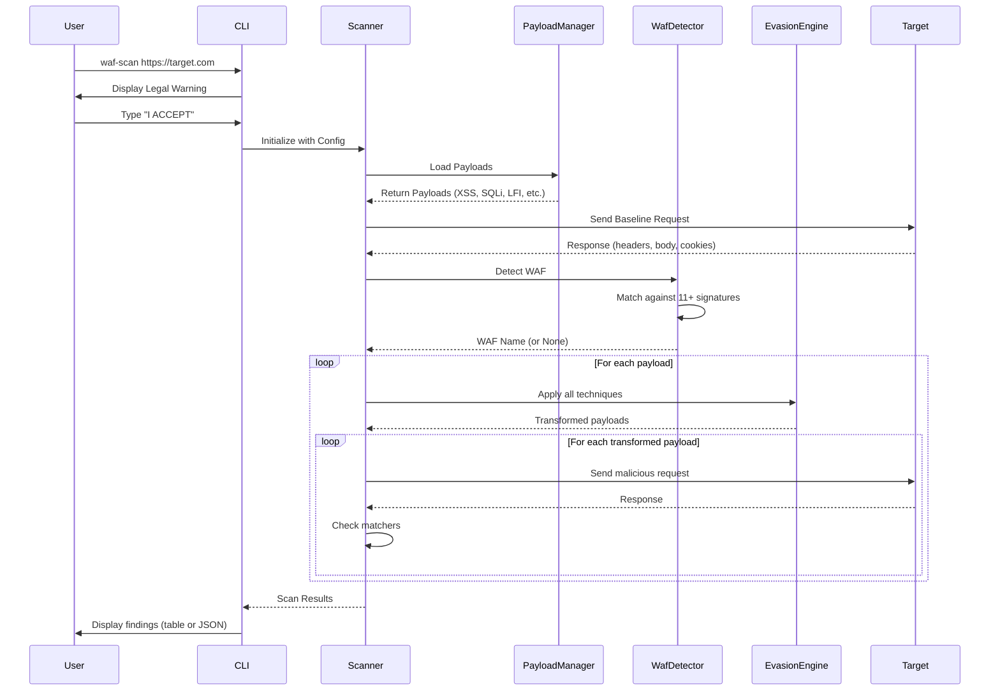

# Simple WAF Scanner

[](https://crates.io/crates/simple-waf-scanner)
[](LICENSE-MIT)

A powerful Web Application Firewall (WAF) detection and bypass testing tool written in Rust for authorized security testing.

---

## ⚠️ **LEGAL DISCLAIMER** ⚠️

```
┌─────────────────────────────────────────────────────────────────────────┐
│                          ⚠️  LEGAL WARNING  ⚠️                           │
│                                                                           │
│  This tool is designed for AUTHORIZED SECURITY TESTING ONLY.            │
│                                                                           │
│  Unauthorized access to computer systems is illegal and may result in:   │
│  • Criminal prosecution under the Computer Fraud and Abuse Act (CFAA)    │
│  • Violations of the Computer Misuse Act (UK) and similar laws globally  │
│  • Civil lawsuits and financial penalties                                │
│  • Imprisonment                                                           │
│                                                                           │
│  By using this tool, you acknowledge that:                               │
│  • You have EXPLICIT WRITTEN PERMISSION to test the target system        │
│  • You understand the legal implications of unauthorized testing         │
│  • The authors assume NO LIABILITY for any misuse or damage              │
│                                                                           │
│  Use responsibly. Test ethically. Stay legal.                            │
└─────────────────────────────────────────────────────────────────────────┘
```

---

## Features

✅ **OWASP Top 10:2025 Aligned** - Includes specialized bypass payloads mapped to:
- **A01:2025** - Broken Access Control (SSRF, Path Traversal, IDOR)
- **A02:2025** - Security Misconfiguration (Default Credentials, Debug Endpoints)
- **A05:2025** - Injection (Advanced SQL/NoSQL/XSS/Command Injection WAF Bypasses)
- **A07:2025** - Authentication Failures (Auth Bypass, Session Fixation, JWT Attacks)
- **A10:2025** - Mishandling of Exceptional Conditions (Error Disclosure)

✅ **WAF Fingerprinting** - Detect 11+ popular WAFs (Cloudflare, Azure Front Door, AWS WAF, Akamai, ModSecurity, Imperva, Sucuri, Wordfence, Barracuda, F5, FortiWeb)

✅ **Advanced Evasion Techniques** - 7+ bypass methods including:
- URL encoding & double encoding
- Case variation
- Null byte injection
- Comment injection
- Unicode normalization
- Path traversal variants

✅ **Comprehensive Payloads** - 300+ sophisticated attack payloads across 16 categories:
- **XSS (Cross-Site Scripting)** - 30+ payloads including polyglots, DOM-based, filter evasion, mutation XSS
- **SQL Injection** - 20+ payloads with time-based blind, boolean-based, WAF-specific bypasses
- **Remote Code Execution (RCE)** - 35+ payloads including shellshock, SSTI, expression language injection
- **Local File Inclusion (LFI)** - 20+ payloads with PHP wrappers, double encoding, null bytes
- **Command Injection** - 30+ payloads with IFS bypass, brace expansion, backslash evasion
- **Path Traversal** - Multiple encoding and obfuscation techniques
- **Server-Side Request Forgery (SSRF)** - 25+ payloads targeting cloud metadata, internal services
- **XML External Entity (XXE)** - 12+ payloads for file disclosure and SSRF
- **NoSQL Injection** - 24+ MongoDB-specific payloads including regex and operator injection
- **Server-Side Template Injection (SSTI)** - 30+ payloads for Jinja2, Freemarker, Thymeleaf, etc.
- **HTTP/2 & AD FS** - CVE-2023-44487 (Rapid Reset), AD FS auth bypass, token replay, MFA bypass
- **OWASP A01** - Broken Access Control bypass techniques
- **OWASP A02** - Security Misconfiguration detection
- **OWASP A05** - Advanced Injection WAF bypasses
- **OWASP A07** - Authentication bypass techniques
- **OWASP A10** - Error handling vulnerabilities

✅ **Structured Payloads** - JSON-based payload system with metadata (severity, category, OWASP references)

✅ **Embedded Defaults** - Ships with all payloads built-in, no external files required

✅ **Custom Payloads** - Load your own payload files in JSON format

✅ **Concurrent Scanning** - Configurable concurrency with rate limiting

✅ **Dual Output Modes** - Pretty terminal tables or JSON export for automation

✅ **Mandatory Consent** - Interactive legal warning prevents accidental misuse

---

## How It Works

### Scan Flow Diagram



### Detection Algorithm

1. **WAF Fingerprinting** - Analyzes response headers, body patterns, status codes, and cookies
2. **Weighted Scoring** - Headers (2 points), other criteria (1 point each)
3. **Threshold** - Score ≥ 2 triggers detection

### Evasion Techniques

Each payload is automatically transformed using:
- **URL Encoding** - `%3Cscript%3E`
- **Double Encoding** - `%253Cscript%253E`
- **Case Variation** - `<ScRiPt>`
- **Null Bytes** - `%00<script>`
- **Comments** - `<scr<!---->ipt>`
- **Unicode** - `\uFF1Cscript\uFF1E`
- **Path Traversal** - `....//`

---

## Installation

### From crates.io

```bash
cargo install simple-waf-scanner
```

### From source

```bash
git clone https://github.com/yourusername/simple-waf-scanner.git
cd simple-waf-scanner
cargo build --release
```

The binary will be at `target/release/waf-scan`.

---

## Usage

### Basic Scan

```bash
waf-scan https://example.com
```

The tool will:
1. Display a mandatory legal warning and require consent
2. Detect any WAF protecting the target
3. Test embedded payloads with all evasion techniques
4. Display results in a formatted table

### Custom Payload File

```bash
waf-scan https://example.com --payload-file custom-payloads.json
```

### Filter Evasion Techniques

```bash
# Only use encoding and case variation techniques
waf-scan https://example.com --techniques encoding,case
```

Available techniques:
- `encoding` - URL encoding
- `double-encode` - Double URL encoding
- `case` - Case variation
- `null-bytes` - Null byte injection
- `comments` - Comment injection
- `unicode` - Unicode normalization
- `path-traversal` - Path traversal variants

### Verbose Mode

Show which specific evasion technique worked for each finding:

```bash
waf-scan https://example.com --verbose
```

### JSON Output

Export results as JSON for integration with other tools:

```bash
waf-scan https://example.com --output-json > results.json
```

### Rate Limiting

Configure request delay (milliseconds):

```bash
waf-scan https://example.com --delay 500
```

### Concurrency Control

```bash
waf-scan https://example.com --concurrency 5
```

---

## Custom Payload Format

Create custom payload files in JSON format:

```json
[
  {
    "id": "custom-xss-1",
    "info": {
      "name": "Custom XSS Test",
      "severity": "high",
      "category": "injection",
      "description": "Custom XSS payload",
      "references": ["https://owasp.org/www-community/attacks/xss/"],
      "tags": ["xss", "custom"]
    },
    "payloads": [
      {
        "value": "<script>alert(1)</script>",
        "encoding": "none",
        "method": "GET"
      }
    ],
    "matchers": [
      {
        "type": "response_body",
        "condition": "contains",
        "patterns": ["<script>alert"]
      }
    ]
  }
]
```

**Severity levels**: `critical`, `high`, `medium`, `low`, `info`

---

## Library Usage

Use as a Rust library in your own projects:

```rust
use simple_waf_scanner::{Config, scan};

#[tokio::main]
async fn main() -> Result<(), Box<dyn std::error::Error>> {
    let mut config = Config::new("https://example.com".to_string());
    config.concurrency = 5;
    config.delay_ms = 200;
    
    let results = scan(config).await?;
    
    println!("WAF Detected: {:?}", results.waf_detected);
    println!("Findings: {}", results.findings.len());
    
    Ok(())
}
```

---

## Output Example

```
══════════════════════════════════════════════════════════════════════
  WAF BYPASS SCAN RESULTS
══════════════════════════════════════════════════════════════════════

Target: https://example.com
Timestamp: 2026-02-03T10:30:00Z
WAF Detected: Cloudflare

╔══════════╦════════════╦═══════════════════════════╦════════╗
║ Severity ║ Category   ║ Payload                   ║ Status ║
╠══════════╬════════════╬═══════════════════════════╬════════╣
║ Critical ║ injection  ║ ' OR '1'='1               ║ 200    ║
║ High     ║ injection  ║ <script>alert('XSS')</..  ║ 200    ║
╚══════════╩════════════╩═══════════════════════════╩════════╝

──────────────────────────────────────────────────────────────────────
  SUMMARY
──────────────────────────────────────────────────────────────────────
Total Payloads Tested: 15
Successful Bypasses: 2
Effective Techniques: 3
Scan Duration: 4.52s
══════════════════════════════════════════════════════════════════════
```

---

## OWASP Top 10:2025 Coverage

This scanner includes specialized payloads aligned with the [OWASP Top 10:2025](https://owasp.org/Top10/2025/), the industry-standard list of critical web application security risks:

### 🔴 A01:2025 - Broken Access Control
**Payloads**: SSRF to cloud metadata (AWS, Azure, GCP), path traversal with encoding bypass, IDOR attacks
- AWS EC2 metadata access via IPv6, decimal IP encoding
- Path traversal with double encoding (`..%252f`)
- Directory traversal with Unicode bypass

### 🟠 A02:2025 - Security Misconfiguration  
**Payloads**: Default credentials, exposed debug endpoints, information disclosure
- Common admin credentials (admin/admin, root/root)
- `.env` file exposure
- Debug endpoints (`/debug`, `/phpinfo.php`, `/server-status`)

### 🔵 A05:2025 - Injection
**Payloads**: Advanced SQL/NoSQL/XSS/Command injection with WAF bypass techniques
- SQL injection with comment obfuscation (`/*!50000AND*/`)
- NoSQL operator injection (`{"$ne":null}`)
- XSS polyglots with encoding tricks
- Command injection with IFS and quote evasion

### 🟢 A07:2025 - Authentication Failures
**Payloads**: Authentication bypass, session attacks, JWT manipulation
- SQL injection auth bypass (`admin' OR '1'='1'--`)
- Session fixation tests
- JWT 'none' algorithm attack

### 🟡 A10:2025 - Mishandling of Exceptional Conditions
**Payloads**: Stack trace disclosure, database error messages
- Triggers for Python/Java stack traces
- Database error messages (MySQL, PostgreSQL, MongoDB)

Each finding automatically maps to its corresponding OWASP category for better remediation guidance.

---

## Development

### Run Tests

```bash
cargo test
```

### Check Code Quality

```bash
cargo clippy --all-targets -- -D warnings
cargo fmt --check
```

### Build Optimized Release

```bash
cargo build --release
```

The release build uses aggressive optimization for minimal binary size.

---

## Contributing

Contributions are welcome! Please:

1. Fork the repository
2. Create a feature branch
3. Add tests for new functionality
4. Ensure all tests pass
5. Submit a pull request

---

## License

Licensed under the MIT License.

See [LICENSE-MIT](LICENSE-MIT) for details.

---

## Responsible Disclosure

If you discover security vulnerabilities in this tool itself, please report them responsibly to the maintainers.

---

## Acknowledgments

- OWASP for security testing resources and payload databases
- The Rust community for excellent async and HTTP libraries
- Security researchers who develop and share bypass techniques ethically

---

**Remember: With great power comes great responsibility. Use this tool ethically and legally.**
